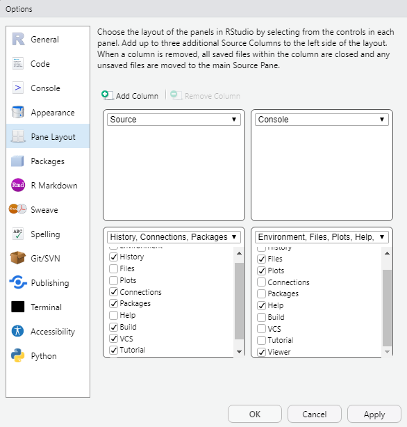

```{r setup, include=FALSE}
knitr::opts_chunk$set(echo = TRUE)
```

<br/>

[🏠↩ De vuelta a la página principal del curso](index.html)

<br/>

## Inicio

> #### **🚀 Objetivo de la unidad**  
 Que el estudiante se familiarice con R y el entorno de desarrollo de RStudio, y sea capaz de crear nuevos scripts y Proyectos de R.

<br/>

**Nota importante:** Los siguientes módulos prácticos son lineales. 

<br/>

## 1.1. Familiarizándoce con RStudio

1. Abra RStudio. 
2. Ubique las siguientes ventanas: *Consola*, *Editor de código*, *Ambiente*, *Archivos*, *Gráficos*, *Historia* y *Ayuda*, y explore los distintos botones dentro de cada una. 
Tip: Ubique el cursor encima de un botón para obtener una breve descripción de su función. 
3. Explore los distintos menús en la barra de navegación principal. 

<br/>

## 1.2. Configuración del entorno de desarrollo
1. En la barra de navegación principal, abra el menú de *Tools* y seleccione *Global options...* 
2. Se abrirá la ventana de *Global options...*. Explore los distintos submenús en la ventana. 
3. Se recomienda ampliamente que, en el submenú de *General*, configure la sección de *Workspace* de la siguiente forma:
    + Desmarque la casila de *Restore .RData into workspace at startup*. 
    + En las opciones disponibles para *Save worspace to .Rdata on exit*, eleccione *Never*.  
4. Opcionalmente, en el submenú de *Pane Layout*, configure la distribución páneles de la siguiente forma: 

</br>
<center>


<br/>

## 1.3. Probando la Consola
1. Ubique la *Consola*. 
2. Familiaricese corriendo algunas líneas de código simples como las siguientes:  
Para correr una línea de código en la *Consola*, solo debe escribirla en el prompt y presionar la tecla *Enter*. 


</br>
```{r}
abs(42) # Valor absoluto de 42
```
</br>
```{r}
3738/89 # 3738÷89
```
</br>
```{r}
2^4 # 2 a la cuarta potencia
```
</br>
```{r}
5%%2 # Módulo de 5÷2
```
</br>
```{r}
log(10) # Logaritmo de 10
```
</br>
```{r}
dbinom(x=3, size=10, prob=1.5)  # P(X=3) for X~B(n=10, p=1.5) 
```
</br>
```{r}
pi # Valor de pi
```
</br>
```{r}
round(41.84) # Redondear 41.84
```
</br>

💡 Las líneas de código o fragmentos de línea de código con un "#" precedente, funjuen como comentarios y no como comandos. Se recomienda ampliamente utilizarlos para documentar sus scripts.    
💡 Para conocer más acerca de las funciones matemáticas en R, corra las siguientes líneas: 
```{r message=FALSE, warning=FALSE}
# help("Math")
# help("Arithmetic")
# help("Trig")
```
💡 Para conocer más acerca de una función específica, corra "?" + el nombre de la función, como en el siguiente ejemplo para la función ```round```.
```{r}
# ?round
```
💡 Algunas líneas de código podrían tardar mucho en terminar de ejecutarse. Para cancelar la ejecución, utilice el botón rojo de *Stop* en la parte superior derecha de la ventana de *Consola*. 

</br>

## 1.4. Un primer script de R
1. En la barra de navegación principal, abra el menú de *File* y seleccione *New File* y luego *R Script*.
2. En la ventana de *Editor de código* se desplegará un nuevo archivo. Escriba algunas líneas de código simples. 
3. Corra algunas líneas de código que ha escrito en el archivo seleccionándolas y presionando la combinación de teclas Ctrl + Ent o con el botón de *Run*. 
4. Para guardar el archivo, en la barra de navegación, abra el menú de *File* y seleccione *Save* o *Save as...*.
5. Se abrirá una nueva venta del explorador de archivos del equipo local de cómputo ubicado en la carpeta de su actual directorio de trabajo.

💡 Se recomienda ampliamente utilizar el siguiente convenio para nombrar scripts:   

* Comenzar con una letra. 
* Utilizar únicamente letras, números y guines bajos (_).
* No utilizar caracteres epeciales. 
* Utilizar *snake_case*, es decir, utilizar guiones bajos (_) en lugar de espacios. 
* Utilizar nombres cortos, claros y concretos.    
    
💡 Observe que a la izquierda de cada línea de código, hay un número de línea. Cuando R reconozca algún error en su línea de código, un tache rojo aparecerá al costado del número de línea, y si ubica el cursor encima del tache rojo obtendrá una breve descripción del error.

</br>

## 1.5 Configuración del directorio de trabajo
1. Ubique la ventana de *Archivos*.
2. Seleccione *More*, y luego *Set As Working Directory*.
<br/> 

💡 Utilice la función ```getwd()``` para obtener la ubicación de su directorio de trabajao actual.

</br>

## 1.6 Un primer Proyecto de R
1. En la barra de navegación principal, abra el menú de *File* y seleccione *New Proyect...*.
2. Se abrirá una venta de *New Project Wizard*. Seleccione *New Directory*, y luego, *New Project*. 
3. Seleccione un nombre para el Proyecto y la carpeta en la que será creado. 

</br>

## 🏋 Ejercicio
1. En RStudio, cree un proyecto de R. 
2. Salga de RStudio y acceda al proyecto que acaba de crear. 
3. Cree un script dentro del proyecto. 
4. Elija un número entero, y en el script, escriba los comandos de R para:
    + Sumar 2 al número de entero de su elección. 
    + Multiplicar por 3 el resultado de la instrucción anterior. 
    + Restar 6 el resultado de la instrucción anterior.
    + Dividir entre 3 el resultado de la instrucción anterior. 
5. Documente su script añadiendo comentarios en donde considere pertinente.
6. Guarde el script utilizando un nombre pertinente. 
7. Desde el explorador de archivos del equipo local de cómputo, agregue una carpeta en su proyecto para almacenar sus scripts y mueva el script a esta. 

<br/>

<center>
