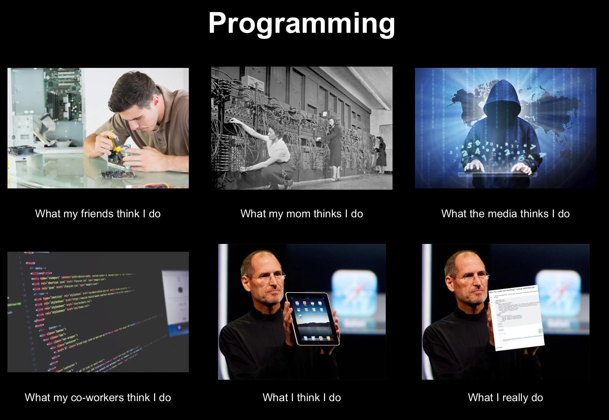

```{r setup, include=FALSE}
knitr::opts_chunk$set(echo = TRUE)
```

<br>

[🏠↩ De vuelta a la página principal del curso](index.html)

<br>

## Inicio

> #### **🚀 Objetivo de la unidad** 
Que el estudiante tenga conocimiento de los elementos básicos de RMarkdown para la creación de documentos con texto, bloques de código y visualizaciones embebidas. 

<br>

6.1. Un primer documento RMarkdown

1. En la barra de navegación principal, abra el menú de File y seleccione New File y luego RMarkdown. 
2. Seleccione un formato predetereminado del documento de salida. (Es posible modificalo después.)
3. En la ventana de *Editor de código* se desplegará un nuevo archivo.
4. Observe la sección superior del documento. Esta sección es completamente editable y contiene los parámetros del documento y la línea de código que permitirá generar el documento de salida. 

```---
title: "Untitled"
author: "sag"
date: '2022-07-29'
output: html_document
---

{r setup, include=FALSE}
knitr::opts_chunk$set(echo = TRUE)
```

5. Al hacer clic en el botón Knit, se generará el documento de salida que incluye tanto el contenido como la salida de cualquier fragmento de código R incrustado dentro del documento. La primera vez que haga clic en este botón, se desplegará una nueva venta del explorador de archivos del equipo local de cómputo ubicado en la carpeta de su actual directorio de trabajo. Navegue a la carpeta en la que desea guardar su script, asigne un nombre al script y de click en Save.
6. Se desplegará una nueva venta de RStudio con la previsualización de su documento de salida. Desde esta ventana, es posible publicar el documento de salida con las opciones en la esquina superior derecha.

<br>

## 6.2. Sintaxis

* Texto plano

Código: 
```Texto plano```

Utilice dos espacios al final de una línea para cambiar de línea.

<br> 

* Texto en bloque 

Código: 
```> Texto en bloque```

Resultado:

> Texto en bloque

<br>

* Lista ordenada

Código: 
```
Lista ordenada
1. item 1
2. item 2
 + sub-item 1
 + sub-item 2 
```

Resultado:

Lista ordenada
1. item 1
2. item 2
 + sub-item 1
 + sub-item 2 

<br>

* Lista no ordenada

Código: 
```
* item 1
* item 2
 + sub-item 1
 + sub-item 2 
```

Resultado:

* item 1
* item 2
 + sub-item 1
 + sub-item 2 

<br>

* Itálicas

Código: 
```*Itálicas*```

Resultado:
*Itálicas*  

<br>

* Negritas

Código: 
```**Negritas**```

Resultado:
**Negritas**  

<br>

* Superíndices

Código: 
```Superíndice^2^```

Resultado:
Superíndice^2^

<br>

* Tachado

Código: 
```~~Tachado~~```

Resultado:
~~Tachado~~


<br>

* Título con importancia *n*

El código incluye *n* `#`, un espacio y el texto del título, donde *n* es el nivel de importancia del título, tiene un rango del 1 al 6 y 1 es el nivel de mayor importancia y 

Código: 

```# Título 1```

```## Título 2```       

```### Título 3```    

```#### Título 4```  

```##### Título 5```  

```###### Título 6```  

<br>

* Hipervínculos

Código:
```[link](www.rstudio.com)``` 

Resultado: 
[link](www.rstudio.com) 

<br>

* Guión corto

Código:
```--``` 

Resultado: 

--

<br>

* Guión largo

Código:
```---``` 

Resultado: 

---

<br>

* Línea horizontal:

Código:
```***``` 

Resultado: 

***

<br>

* Ecuación

Código:
```$A = \pi*r^{2}$``` 

Resultado: 
$A = \pi*r^{2}$

<br>

* Imagen

Código:
`````` 

Resultado: 



## 🏊️ Ejercicio
1. Explore los datos del INEGI, el ENIGH y el ENOE. 
2. Plantee una pregunta de investigación clara, enfocada, concisa y sencilla con base en lo explorado. 
3. Construya una visualización de datos que responda a dicha pregunta de investigación. 
4. Redacte un RMarkdown en el que incluya:
   * Un marco teórico a su pregunta de investigación.
   * El flujo de preprocesamiento de los datos (**incluyendo bloques de código documentado**) que tuvo que seguir para llegar al conjunto de datos final con el que construyó su visualización.
   * El flujo de construcción de la visualización (**incluyendo bloques de código documentado**). 
   * Conclusiones basadas en lo observado en la visualización.
5. Publíquelo en [Rpubs.com](https://rpubs.com/) 😎 